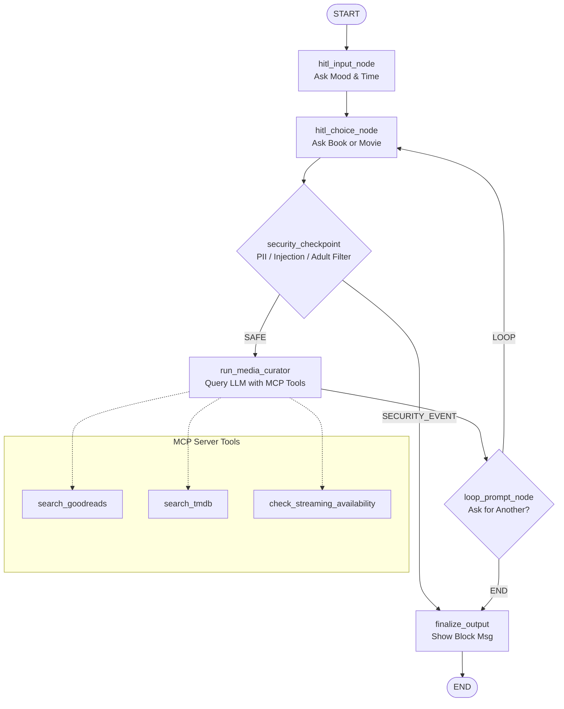

# 📝 Submission Write-Up: media-curator

## 1. Problem Statement
Many users feel overwhelmed by the sheer volume of choices on modern streaming platforms and reading lists. They often spend more time browsing than actually consuming content.
**media-curator** addresses this "choice paralysis" by offering a streamlined, secure, and interactive recommendation system. Users can state their mood and time availability in plain English, choose a preference (book or movie/show), and receive exactly one tailored recommendation along with its rating and availability.

---

## 2. Solution Architecture
The application runs as an ADK 2.0 Workflow state graph. Here is the layout of the workflow:

---

## 3. Concepts Used & Implementation References

### ADK Workflow Graph
- **Definition:** The agent flow is modeled as a state machine using the ADK 2.0 Workflow API.
- **Reference:** [agent.py](file:///d:/adk-worksspace/media-curator/app/agent.py#L202-L224) where the `Workflow` class organizes edges and nodes.

### LlmAgent & AgentTool
- **Definition:** The orchestrator agent is defined as an `LlmAgent` subclassing from the ADK SDK, equipped with instructions and tools.
- **Reference:** [agent.py](file:///d:/adk-worksspace/media-curator/app/agent.py#L33-L51) where `media_curator` is defined.

### MCP Server (Model Context Protocol)
- **Definition:** A local FastMCP server exposing search tools for Goodreads (books), TMDB (movies), and streaming platform availability checks.
- **Reference:** [mcp_server.py](file:///d:/adk-worksspace/media-curator/app/mcp_server.py) implements the tools, and [agent.py](file:///d:/adk-worksspace/media-curator/app/agent.py#L23-L31) loads the server parameters using stdio transport.

### Security Checkpoint
- **Definition:** A validation node acting as a gateway before hitting LLM endpoints. It performs regex scrubbing of emails/PII and blocks malicious injections.
- **Reference:** [agent.py](file:///d:/adk-worksspace/media-curator/app/agent.py#L78-L106) implements `security_checkpoint`.

### Human-in-the-Loop (HITL) Flow
- **Definition:** The workflow uses `RequestInput` events to pause execution and request input from the user (such as preference choice and retry loops).
- **Reference:** [agent.py](file:///d:/adk-worksspace/media-curator/app/agent.py#L53-L76) implements `hitl_input_node` and `hitl_choice_node`.

---

## 4. Security Design
- **PII Scrubbing:** Automatically redacts email addresses with the regex `[\w\.-]+@[\w\.-]+` before passing data downstream.
- **Prompt Injection Defense:** Scans inputs for known injection vectors (e.g., `"ignore previous instructions"`, `"bypass"`) and routes them to a secure terminal node instead of exposing the LLM.
- **Structured Auditing:** Serializes safety audit logs to standard JSON output containing audit fields (severity, action, reason) for easy monitoring.

---

## 5. MCP Server Design
The local Model Context Protocol server offers three distinct tools:
1. **`search_goodreads`**: Queries book metadata, ratings, and plot summaries.
2. **`search_tmdb`**: Queries movies and TV show ratings and details.
3. **`check_streaming_availability`**: Locates where a movie/show can be streamed.

---

## 6. HITL (Human-in-the-Loop) Flow
- **Preference Discovery:** The agent begins by prompting the user for mood and time availability.
- **Dynamic Choice:** Next, the agent pauses to ask: `"movie or book? 🎬📚"`. This guarantees the recommendation aligns with the user's specific media format choice.
- **Iteration Prompt:** After a recommendation, the agent asks if they want another suggestion, allowing them to restart the choice phase without losing their initial context.

---

## 7. Demo Walkthrough
1. **Initial Preferences:** User inputs mood (e.g., "lazy evening") and time availability (e.g., "2 hours").
2. **Media Select:** User submits "movie" as their choice.
3. **LLM Query & MCP Tools:** The orchestrator agent invokes TMDB and availability checks via MCP and formats the output.
4. **Final Recommendation:** User gets exactly 1 recommended movie with platform details.
5. **Next Choice:** The user can request another recommendation to explore additional ideas.

---

## 8. Impact / Value Statement
By integrating safety filters, local tool protocols (MCP), and structured workflow states, **media-curator** demonstrates how AI agents can deliver specific, actionable recommendations quickly, securely, and within a highly readable, premium user interface.
